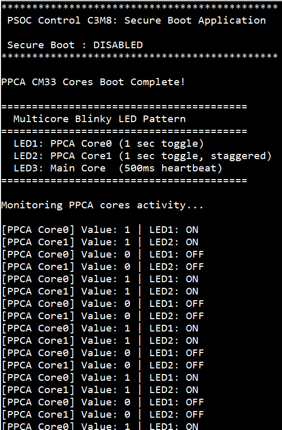
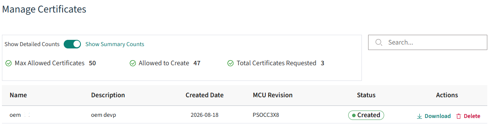
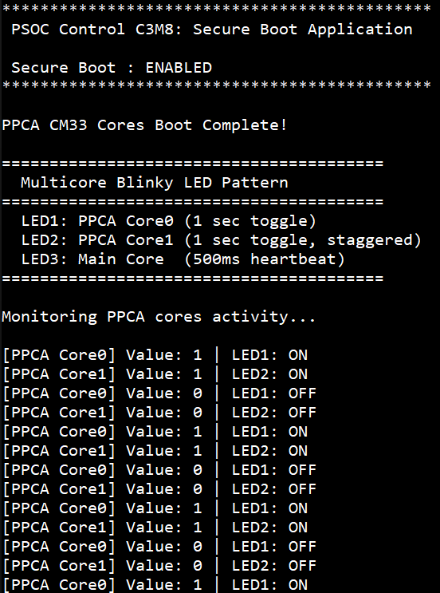

# PSOC&trade; Control C3M/P8: Secure Boot application

This code example applies for PSOC&trade; Control C3M/P8 MCUs. This code example showcases the Secure Boot capability of the PSOC&trade; Control C3M8 device. With secure boot enabled, the BootROM validates the authenticity of the application image before handing over execution, ensuring only trusted firmware is launched.

The example guides you through the essential steps required to enable and validate secure boot:

- Generate the cryptographic key pairs used for authenticated boot
- Provisioning the device with the policy settings required to enable Secure Boot
- Build and produce signed application images for execution under Secure Boot

This code example consists of three projects: a CM33 secure boot application and two PPCA CM33 core applications. At runtime, both PPCA cores report their variable values over UART while toggling LED1 and LED2, and the main core indicates system activity through an LED3 heartbeat.

This code example builds upon the implementation of the [PSOC&trade; Control C3M/P8: Multicore Blinky Application](https://github.com/Infineon/mtb-example-ce241617-multicore-blinky-app). For additional details, refer to the README of the Multicore Blinky Application CE.

[View this README on GitHub.](https://github.com/Infineon/mtb-example-ce241472-secureboot)

[Provide feedback on this code example.](https://yourvoice.infineon.com/jfe/form/SV_1NTns53sK2yiljn?Q_EED=eyJVbmlxdWUgRG9jIElkIjoiQ0UyNDE0NzIiLCJTcGVjIE51bWJlciI6IjAwMi00MTQ3MiIsIkRvYyBUaXRsZSI6IlBTT0MmdHJhZGU7IENvbnRyb2wgQzNNL1A4OiBTZWN1cmUgQm9vdCBhcHBsaWNhdGlvbiIsInJpZCI6InZpbmF5LnJhbmdhc3dhbXlAaW5maW5lb24uY29tIiwiRG9jIHZlcnNpb24iOiIxLjAuMCIsIkRvYyBMYW5ndWFnZSI6IkVuZ2xpc2giLCJEb2MgRGl2aXNpb24iOiJNQ0QiLCJEb2MgQlUiOiJJQ1ciLCJEb2MgRmFtaWx5IjoiUFNPQyJ9)


## Requirements

- [ModusToolbox&trade;](https://www.infineon.com/modustoolbox) v3.9.0 or later (tested with v3.9.0)
- Board support package (BSP) minimum required version for:
   - KIT_PSC3M8_EVK: v2.2.0
- Programming language: C
- Associated parts: All [PSOC&trade; Control C3M/P8 MCU](https://www.infineon.com/products/microcontroller/32-bit-psoc-arm-cortex/32-bit-psoc-control-arm-cortex-m33-mcu/psoc-control-c3-performance-line) parts


## Supported toolchains (make variable 'TOOLCHAIN')

- GNU Arm&reg; Embedded Compiler v14.2.1 (`GCC_ARM`) – Default value of `TOOLCHAIN`
- Arm&reg; Compiler v6.22 (`ARM`)
- IAR C/C++ Compiler v9.70.4 (`IAR`)


## Supported kits (make variable 'TARGET')

- [PSOC&trade; Control C3M8 Evaluation Kit](https://www.infineon.com/KIT_PSC3M8_EVK) (`KIT_PSC3M8_EVK`) – Default value of `TARGET`


## Hardware setup

This example uses the board's default configuration. See the kit user guide to ensure that the board is configured correctly.


## Software setup

See the [ModusToolbox&trade; tools package installation guide](https://www.infineon.com/ModusToolboxInstallguide) for information about installing and configuring the tools package.

<details><summary><b>ModusToolbox&trade; Edge Protect Security Suite</b></summary>

1. Download and install the [Infineon Developer Center Launcher](https://www.infineon.com/cms/en/design-support/tools/utilities/infineon-developer-center-idc-launcher)

2. Login using your Infineon credentials

3. Download and install the “ModusToolbox&trade; Edge Protect Security Suite” from Developer Center Launcher

    > **Note:** The default installation directory of the Edge Protect Security Suite in Windows operating system is *C:/Users/`<USER>`/Infineon/Tools*

4. After installing the Edge Protect Security Suite, add the Edge Protect tools executable to the system PATH variable

   Edge Protect tools executable is located in *<Edge-Protect-Security-Suite-install-path>/ModusToolbox-Edge-Protect-Security-Suite-`<version>`/tools/edgeprotecttools/bin*

</details>

Install a terminal emulator if you do not have one. Instructions in this document use [Tera Term](https://teratermproject.github.io/index-en.html).

This example requires no additional software or tools.

## Using the code example


### Create the project

The ModusToolbox&trade; tools package provides the Project Creator as both a GUI tool and a command line tool.

<details><summary><b>Use Project Creator GUI</b></summary>

1. Open the Project Creator GUI tool

   There are several ways to do this, including launching it from the dashboard or from inside the Eclipse IDE. For more details, see the [Project Creator user guide](https://www.infineon.com/ModusToolboxProjectCreator) (locally available at *{ModusToolbox&trade; install directory}/tools_{version}/project-creator/docs/project-creator.pdf*)

2. On the **Choose Board Support Package (BSP)** page, select a kit supported by this code example. See [Supported kits](#supported-kits-make-variable-target)

   > **Note:** To use this code example for a kit not listed here, you may need to update the source files. If the kit does not have the required resources, the application may not work

3. On the **Select Application** page:

   a. Select the **Application(s) Root Path** and the **Target IDE**

      > **Note:** Depending on how you open the Project Creator tool, these fields may be pre-selected for you

   b. Select this code example from the list by enabling its check box

      > **Note:** You can narrow the list of displayed examples by typing in the filter box

   c. (Optional) Change the suggested **New Application Name** and **New BSP Name**

   d. Click **Create** to complete the application creation process

</details>


<details><summary><b>Use Project Creator CLI</b></summary>

The 'project-creator-cli' tool can be used to create applications from a CLI terminal or from within batch files or shell scripts. This tool is available in the *{ModusToolbox&trade; install directory}/tools_{version}/project-creator/* directory.

Use a CLI terminal to invoke the 'project-creator-cli' tool. On Windows, use the command-line 'modus-shell' program provided in the ModusToolbox&trade; installation instead of a standard Windows command-line application. This shell provides access to all ModusToolbox&trade; tools. You can access it by typing "modus-shell" in the search box in the Windows menu. In Linux and macOS, you can use any terminal application.

The following command clones the "[Secure Boot Application](https://github.com/Infineon/mtb-example-ce241472-secureboot)" with the desired name "SecureBootApp" configured for the *KIT_PSC3M8_EVK* BSP into the specified working directory, *C:/mtb_projects*:


    project-creator-cli --board-id KIT_PSC3M8_EVK --app-id mtb-example-ce241472-secureboot --user-app-name SecureBootApp --target-dir "C:/mtb_projects"


The 'project-creator-cli' tool has the following arguments:

Argument | Description | Required/optional
---------|-------------|-----------
`--board-id` | Defined in the <id> field of the [BSP](https://github.com/Infineon?q=bsp-manifest&type=&language=&sort=) manifest | Required
`--app-id`   | Defined in the <id> field of the [CE](https://github.com/Infineon?q=ce-manifest&type=&language=&sort=) manifest | Required
`--target-dir`| Specify the directory in which the application is to be created if you prefer not to use the default current working directory | Optional
`--user-app-name`| Specify the name of the application if you prefer to have a name other than the example's default name | Optional

<br>

> **Note:** The project-creator-cli tool uses the `git clone` and `make getlibs` commands to fetch the repository and import the required libraries. For details, see the "Project creator tools" section of the [ModusToolbox&trade; tools package user guide](https://www.infineon.com/ModusToolboxUserGuide) (locally available at {ModusToolbox&trade; install directory}/docs_{version}/mtb_user_guide.pdf).

</details>


### Open the project

After the project has been created, you can open it in your preferred development environment.


<details><summary><b>Eclipse IDE</b></summary>

If you opened the Project Creator tool from the included Eclipse IDE, the project will open in Eclipse automatically.

For more details, see the [Eclipse IDE for ModusToolbox&trade; user guide](https://www.infineon.com/MTBEclipseIDEUserGuide) (locally available at *{ModusToolbox&trade; install directory}/docs_{version}/mt_ide_user_guide.pdf*).

</details>


<details><summary><b>Visual Studio (VS) Code</b></summary>

Launch VS Code manually, and then open the generated *{project-name}.code-workspace* file located in the project directory.

For more details, see the [Visual Studio Code for ModusToolbox&trade; user guide](https://www.infineon.com/MTBVSCodeUserGuide) (locally available at *{ModusToolbox&trade; install directory}/docs_{version}/mt_vscode_user_guide.pdf*).

</details>


<details><summary><b>Arm&reg; Keil&reg; µVision&reg;</b></summary>

Double-click the generated *{project-name}.cprj* file to launch the Keil&reg; µVision&reg; IDE.

For more details, see the [Arm&reg; Keil&reg; µVision&reg; for ModusToolbox&trade; user guide](https://www.infineon.com/MTBuVisionUserGuide) (locally available at *{ModusToolbox&trade; install directory}/docs_{version}/mt_uvision_user_guide.pdf*).

</details>


<details><summary><b>IAR Embedded Workbench</b></summary>

Open IAR Embedded Workbench manually, and create a new project. Then select the generated *{project-name}.ipcf* file located in the project directory.

For more details, see the [IAR Embedded Workbench for ModusToolbox&trade; user guide](https://www.infineon.com/MTBIARUserGuide) (locally available at *{ModusToolbox&trade; install directory}/docs_{version}/mt_iar_user_guide.pdf*).

</details>


<details><summary><b>Command line</b></summary>

If you prefer to use the CLI, open the appropriate terminal, and navigate to the project directory. On Windows, use the command-line 'modus-shell' program; on Linux and macOS, you can use any terminal application. From there, you can run various `make` commands.

For more details, see the [ModusToolbox&trade; tools package user guide](https://www.infineon.com/ModusToolboxUserGuide) (locally available at *{ModusToolbox&trade; install directory}/docs_{version}/mtb_user_guide.pdf*).

</details>


## Operation

1. Connect the board to your PC using the provided USB cable through the Debug USB connector on the board

2. Open a terminal program and select the KitProg3 COM port. Set the serial port parameters to 8N1 and 115200 baud


### Run the application in normal boot mode

In normal boot, the application image is not signed and the device boots without image authentication. This is the default configuration of the code example, so no changes are required before programming.

1. Program the board using one of the following:

   <details><summary><b>Using Eclipse IDE</b></summary>

      1. Select the application project in the Project Explorer

      2. In the **Quick Panel**, scroll down, and click **\<Application Name> Program**
   </details>


   <details><summary><b>In other IDEs</b></summary>

   Follow the instructions in your preferred IDE
   </details>


   <details><summary><b>Using CLI</b></summary>

     From the terminal, execute the `make program` command to build and program the application using the default toolchain to the default target. The default toolchain is specified in the application's common.mk but you can override this value manually:
      ```
      make program TOOLCHAIN=<toolchain>
      ```

      Example:
      ```
      make program TOOLCHAIN=GCC_ARM
      ```
   </details>

2. After programming, the application starts automatically. Verify that the UART terminal displays “PSOC Control C3M8: Secure Boot Application” and “Secure Boot: DISABLED.” Confirm that LED1 and LED2 toggle at 1 Hz for the PPCA cores, while LED3 (main_cm33_s) operates as a 500 ms heartbeat and is not tracked in the UART output.

   **Figure 1. Terminal output on normal boot**

   


### Run the application in secure boot mode

In secure boot, the BootROM validates the authenticity of the application image before handing over execution, so the device must be provisioned to enable secure boot and the application image must be signed. Complete the provisioning steps below, then build and program the signed image.

#### Provision the device to enable secure boot

**Prerequisite**

Infineon’s Edge Protect Tools is a set of command line tools used to perform the functions needed for key signing, key generation, OEM certificate creation, device provisioning, and so on. These tools are executed through a shell tool. **Edge Protect Tools** executable is made available in the location *C:\Users\<username>\Infineon\Tools\ModusToolbox-Edge-Protect-Security-Suite-a.b.c\tools\edgeprotecttools\bin* directory.


Add the executable path to the system environment path variable of the host PC.

To use Edge Protect Tools CLI, is recommended to use "modus-shell", which is installed along with ModusToolbox&trade; located in the *ModusToolbox/tools_x.y* directory. 


**Transfer of ownership**

Ownership of the device should be transferred to yourself before changing the policy file. Follow the steps to transfer ownership

1. Open modus-shell and navigate to the application directory

    ```
    cd <app-directory>
    ```

2. Execute the following command to initialize the tools.

    ```
    edgeprotecttools -t psoc_c3x8 init
    ```

3. Execute the following command to configure the openOCD tools path:

    ```
    edgeprotecttools set-ocd --name openocd --path <openocd_path>
    ```

    > **Note:** Replace <openocd_path> with the path to the openocd directory. Typically, this will be *C:/infineon/Tools/ModusToolboxProgtools-x.y/openocd*

4. Create a private and public key pair. The following command generates one pair of keys that is placed in the keys directory:

    ```
    edgeprotecttools --no-interactive-mode create-key --key-type ECDSA-P521 -o keys/oem_dev_priv_key.pem keys/oem_dev_pub_key.pem
    ```

5. To generate a new CSR, execute this command:

    ```
    edgeprotecttools -t psoc_c3x8 oem-csr --public-key-0 keys/oem_dev_pub_key.pem --public-key-1 keys/oem_dev_pub_key.pem --sign-key-0 keys/oem_dev_priv_key.pem --sign-key-1 keys/oem_dev_priv_key.pem --oem "Company Name" --project "Project Name" --project-number 12345678 --cert-type development --output keys/oem_csr_development.bin
    ```

6. Once the CSR is created, it must be signed by Infineon to create a valid OEM certificate. Follow these steps outlined to generate an Infineon signed OEM certificate

   1. Prior to creating a certificate, you must sign up for an Infineon online software tools and services (OSTS) account. Any developer may create an OSTS account by registering at [osts.infineon.com](https://osts.infineon.com/epss/home)

   2. Once you have registered, login to your OSTS account and click on **Edge Protect Signing Service**. This will take you to a page where you can upload your Certificate Signing Request (CSR) that you created in the previous step. Click on the **Upload New Certificate Request** button. This will take you to a window where you can upload your CSR, enter a name for the certificate, and enter a description

   **Figure 2. Upload new certificate request**

   
     
   3. Enter the certificate name without any spaces or special characters, if you enter the name as “oem”, the generated certificate will be named “oem_cert.bin”. Select the silicon revision as **PSOCC3X8**. Next, enter the description for this certificate in the “Description” field. This description will be in the list of certs that you own, so you can easily identify one cert from another if you have more than one

   4. Click the **Drop file here or click to upload button** to upload the CSR and navigate to the CSR that you created in the previous step instead of dropping the file in this area. In the previous steps, the path was *`<app-directory>`/keys/oem_csr_development.bin*
         
   **Figure 3. Uploading CSR**

   

   5. Once the name and description have been entered and the CSR has been uploaded, click the **Submit** button. This should take you back to the original page with a list of certificates under **Manage Certificates**. If the list does not show the most recent certificate generated, click on the **Refresh List**. You should now see the signed certificate ready for you to download. 
   Click on the **Download** button on the line that contains the certificate you want to download. This will download the signed certificate to the location on your computer where the files are downloaded

   **Figure 4. Manage certificates**

   

   > **Note:** You can revisit this website at any time and download any of the certificates that have been signed in the past. During development, you only need to perform these steps once, but you can generate multiple certificates if needed


7. Place the certificate obtained in the *`<app-directory>`/keys/* folder as *oem_cert_development.bin*. Provision the device with the key and certificate to transfer the ownership

    ```
    edgeprotecttools -t psoc_c3x8 provision-device -p policy/policy_oem_provisioning.json --ifx-oem-cert keys/oem_cert_development.bin --key keys/oem_dev_priv_key.pem
    ```

**Provision to enable secure boot**

To enable secure boot in the PSOC&trade; Control device, update the necessary fields in the OEM policy and provision the device with the updated policy file. 

The OEM policy file (*policy_oem_provisioning.json*) is located in the *`<app-directory>`/policy/* directory, which is created when `edgeprotecttools` is initialized.

1. In the OEM policy, set `device_policy` > `boot` > `boot_cfg_id` > `value` to 'SECURE_APP'

    ```
    "boot": {
      "boot_cfg_id": {
        "description": "A behavior for BOOT_APP_LAYOUT (BOOT_SIMPLE_APP applicable to NORMAL_PROVISIONED only)",
        "applicable_conf": "SIMPLE_APP, SECURE_APP, DUAL_BANK_SIMPLE_APP, DUAL_BANK_SECURE_APP, PROT_FW",
        "value": "SECURE_APP"
      },
    ```
2. In the OEM policy, update the `device_policy` > `boot` > `boot_app_layout` field as shown below to provide application start and size information to BootROM 

    ```
      "boot_app_layout": {
        "description": "The memory layout for the applications defined by BOOT_CFG_ID. 0x32000000 - 0x33FFFFFF for secure addresses; 0x22000000 - 0x23FFFFFF for non-secure addresses",
        "value": [
          {
            "address": "0x32000000",
            "size": "0x6E000"
          },
          {
            "address": "0x3206E000",
            "size": "0x9000"
          },
          {
            "address": "0x32077000",
            "size": "0x9000"
          },
          {
            "address": "0x00000000",
            "size": "0x00"
          },
          {
            "address": "0x00000000",
            "size": "0x00"
          }
        ]
      },
    ```

3. Once the policy is updated, provision the device with the updated policy

    ```
    edgeprotecttools -t psoc_c3x8 provision-device -p policy/policy_oem_provisioning.json --ifx-oem-cert keys/oem_cert_development.bin --key keys/oem_dev_priv_key.pem
    ```


#### Build and program the signed image

With the device provisioned for secure boot, enable image signing and program the signed image.

1. Enable image signing as a post-build step in the project by updating `SECURED_BOOT` to `TRUE` in the file *common.mk* present in the application root directory

   ```
   SECURED_BOOT?=TRUE
   ```

2. Update the launch configurations (Optional Step in C3M/P8)

   1. Select the application project in the Project Explorer

   2. In the **Quick Panel**, scroll down, and click **Generate Launches for \<Application Name>**

   > **Note:** Whenever you change the value of `SECURED_BOOT` (TRUE or FALSE), regenerate the launch configuration for the changes to take effect

3. Program the board using one of the following:

   <details><summary><b>Using Eclipse IDE</b></summary>

      1. Select the application project in the Project Explorer

      2. In the **Quick Panel**, scroll down, and click **\<Application Name> Program (KitProg3_MiniProg4)**
   </details>


   <details><summary><b>In other IDEs</b></summary>

   Follow the instructions in your preferred IDE.
   </details>


   <details><summary><b>Using CLI</b></summary>

     From the terminal, execute the `make program` command to build and program the application using the default toolchain to the default target. The default toolchain is specified in the application's common.mk but you can override this value manually:
      ```
      make program TOOLCHAIN=<toolchain>
      ```

      Example:
      ```
      make program TOOLCHAIN=GCC_ARM
      ```
   </details>

4. After programming, the application starts automatically after BootROM validation. Verify that the UART terminal displays “PSOC Control C3M8: Secure Boot Application” and “Secure Boot: ENABLED.” Confirm that LED1 and LED2 toggle at 1 Hz for the PPCA cores, while LED3 (main_cm33_s) operates as a 500 ms heartbeat and is not tracked in the UART output.

  **Figure 2. Terminal output on secure boot**

  

5. Optional Step - After secure boot is validated, to restore the device to its default configuration for executing other code examples with secure boot disabled, follow the steps in [Steps to restore the device (Disable secure boot)](#steps-to-restore-the-device-disable-secure-boot).


### Steps to restore the device (Disable secure boot)

To return the device to normal boot, revert both the device provisioning policy and the application build configuration.

1. In the OEM policy, set `device_policy` > `boot` > `boot_cfg_id` > `value` to 'SIMPLE_APP'

    ```
    "boot": {
      "boot_cfg_id": {
        "description": "A behavior for BOOT_APP_LAYOUT (BOOT_SIMPLE_APP applicable to NORMAL_PROVISIONED only)",
        "applicable_conf": "SIMPLE_APP, SECURE_APP, DUAL_BANK_SIMPLE_APP, DUAL_BANK_SECURE_APP, PROT_FW",
        "value": "SIMPLE_APP"
      },
    ```
2. Optional settings: In the OEM policy, update the `device_policy` > `boot` > `boot_app_layout` field as shown below

    ```
      "boot_app_layout": {
        "description": "The memory layout for the applications defined by BOOT_CFG_ID. 0x32000000 - 0x33FFFFFF for secure addresses; 0x22000000 - 0x23FFFFFF for non-secure addresses",
        "value": [
          {
            "address": "0x32000000",
            "size": "0x40000"
          },
          {
            "address": "0x00000000",
            "size": "0x00"
          },
          {
            "address": "0x00000000",
            "size": "0x00"
          },
          {
            "address": "0x00000000",
            "size": "0x00"
          },
          {
            "address": "0x00000000",
            "size": "0x00"
          }
        ]
      },
    ```

3. Once the policy changes are reverted, provision the device

    ```
    edgeprotecttools -t psoc_c3x8 provision-device -p policy/policy_oem_provisioning.json --ifx-oem-cert keys/oem_cert_development.bin --key keys/oem_dev_priv_key.pem
    ```

#### Revert the application build configuration (Optional)

These steps affect only the application build; they do not change anything on the device.

1. Set `SECURED_BOOT` back to `FALSE` in the file *common.mk* present in the application root directory

   ```
   SECURED_BOOT?=FALSE
   ```

2. Update the launch configurations

   1. Select the application project in the Project Explorer

   2. In the **Quick Panel**, scroll down, and click **Generate Launches for \<Application Name>**

   > **Note:** Whenever you change the value of `SECURED_BOOT` (TRUE or FALSE), regenerate the launch configuration for the changes to take effect


## Debugging

You can debug the example to step through the code.


<details><summary><b>In Eclipse IDE</b></summary>

Use the **\<Application Name> Debug (KitProg3_MiniProg4)** configuration in the **Quick Panel**. For details, see the "Program and debug" section in the [Eclipse IDE for ModusToolbox&trade; user guide](https://www.infineon.com/MTBEclipseIDEUserGuide).


</details>


<details><summary><b>In other IDEs</b></summary>

Follow the instructions in your preferred IDE.

</details>


## Design and implementation

This code example follows the same design as **PSOC&trade; Control C3M/P 8: Multicore blinky application**, The distinction lies in the build process, which includes a post-build signing operation performed by the signer-combiner tool to produce MCUboot-compliant signed images when `SECURED_BOOT` flag is set to `TRUE`. This signing step inserts the metadata required by the BootROM to validate and authenticate images, thereby ensuring that only trusted firmware is executed.


### Resources and settings

The application uses the Normal boot vs Secure boot, and UART to print messages on the UART terminal. The UART resource initialization and retargeting of standard I/O to the UART port is performed using the [retarget-io](https://github.com/Infineon/retarget-io) library.

**Table 1. Application resources**

 Resource  |  Alias/object     |    Purpose
 :-------- | :-------------    | :------------
 UART (HAL) | DEBUG_UART_hal_obj | UART HAL object used by Retarget-IO for the Debug UART port
 GPIO (PDL) | CYBSP_USER_LED1    | User LED1 from main core for PPCA Core 0 value update
 GPIO (PDL) | CYBSP_USER_LED2    | User LED1 from main core for PPCA Core 1 value update
 GPIO (PDL) | CYBSP_USER_LED3    | User LED3 from main core at fixed frequency of 1Hz
<br>


## Related resources

Resources  | Links
-----------|----------------------------------
Code examples  | [Using ModusToolbox&trade;](https://github.com/Infineon/Code-Examples-for-ModusToolbox-Software) on GitHub
Device documentation | [PSOC&trade; Control C3M/P8 MCU documents](https://www.infineon.com/products/microcontroller/32-bit-psoc-arm-cortex/32-bit-psoc-control-arm-cortex-m33-mcu/psoc-control-c3-performance-line?ftab=01#Documents)
Development kits | Select your kits from the [Evaluation board finder](https://www.infineon.com/cms/en/design-support/finder-selection-tools/product-finder/evaluation-board)
Libraries on GitHub  | [mtb-dsl-psc3m8](https://github.com/Infineon/mtb-dsl-psc3m8) – Device Support Library (DSL) <br> [retarget-io](https://github.com/Infineon/retarget-io) – Utility library to retarget STDIO messages to a UART port
Tools  | [ModusToolbox&trade;](https://www.infineon.com/modustoolbox) – ModusToolbox&trade; software is a collection of easy-to-use libraries and tools enabling rapid development with Infineon MCUs for applications ranging from wireless and cloud-connected systems, edge AI/ML, embedded sense and control, to wired USB connectivity using PSOC&trade; Industrial/IoT MCUs, AIROC&trade; Wi-Fi and Bluetooth&reg; connectivity devices, XMC&trade; Industrial MCUs, and EZ-USB&trade;/EZ-PD&trade; wired connectivity controllers. ModusToolbox&trade; incorporates a comprehensive set of BSPs, HAL, libraries, configuration tools, and provides support for industry-standard IDEs to fast-track your embedded application development

<br>


## Other resources

Infineon provides a wealth of data at [www.infineon.com](https://www.infineon.com) to help you select the right device, and quickly and effectively integrate it into your design.


## Document history


Document title: *CE241472* – *PSOC&trade; Control C3M/P8 MCU: Secure Boot application*

 Version | Description of change
 ------- | ---------------------
 1.0.0   | New code example
<br>


All referenced product or service names and trademarks are the property of their respective owners.

The Bluetooth&reg; word mark and logos are registered trademarks owned by Bluetooth SIG, Inc., and any use of such marks by Infineon is under license.

PSOC&trade;, formerly known as PSoC&trade;, is a trademark of Infineon Technologies. Any references to PSoC&trade; in this document or others shall be deemed to refer to PSOC&trade;.

---------------------------------------------------------

(c) 2026, Infineon Technologies AG, or an affiliate of Infineon Technologies AG. All rights reserved.
This software, associated documentation and materials ("Software") is owned by Infineon Technologies AG or one of its affiliates ("Infineon") and is protected by and subject to worldwide patent protection, worldwide copyright laws, and international treaty provisions. Therefore, you may use this Software only as provided in the license agreement accompanying the software package from which you obtained this Software. If no license agreement applies, then any use, reproduction, modification, translation, or compilation of this Software is prohibited without the express written permission of Infineon.
<br>
Disclaimer: UNLESS OTHERWISE EXPRESSLY AGREED WITH INFINEON, THIS SOFTWARE IS PROVIDED AS-IS, WITH NO WARRANTY OF ANY KIND, EXPRESS OR IMPLIED, INCLUDING, BUT NOT LIMITED TO, ALL WARRANTIES OF NON-INFRINGEMENT OF THIRD-PARTY RIGHTS AND IMPLIED WARRANTIES SUCH AS WARRANTIES OF FITNESS FOR A SPECIFIC USE/PURPOSE OR MERCHANTABILITY. Infineon reserves the right to make changes to the Software without notice. You are responsible for properly designing, programming, and testing the functionality and safety of your intended application of the Software, as well as complying with any legal requirements related to its use. Infineon does not guarantee that the Software will be free from intrusion, data theft or loss, or other breaches (“Security Breaches”), and Infineon shall have no liability arising out of any Security Breaches. Unless otherwise explicitly approved by Infineon, the Software may not be used in any application where a failure of the Product or any consequences of the use thereof can reasonably be expected to result in personal injury.
